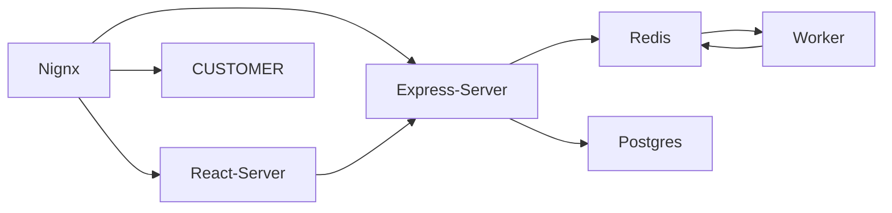

# Fibonacci-in-overcomplicated-way-with-docker

This project was done to learn docker.
Multi-container application.
Production ready.

```mermaid
graph LR;
    Nignx-->Express-Server;
    Nignx-->React-Server;
    Nignx-->CUSTOMER;
    React-Server-->Express-Server;
    Express-Server-->Redis;
    Express-Server-->Postgres;
    Redis-->Worker;
    Worker-->Redis;
```
